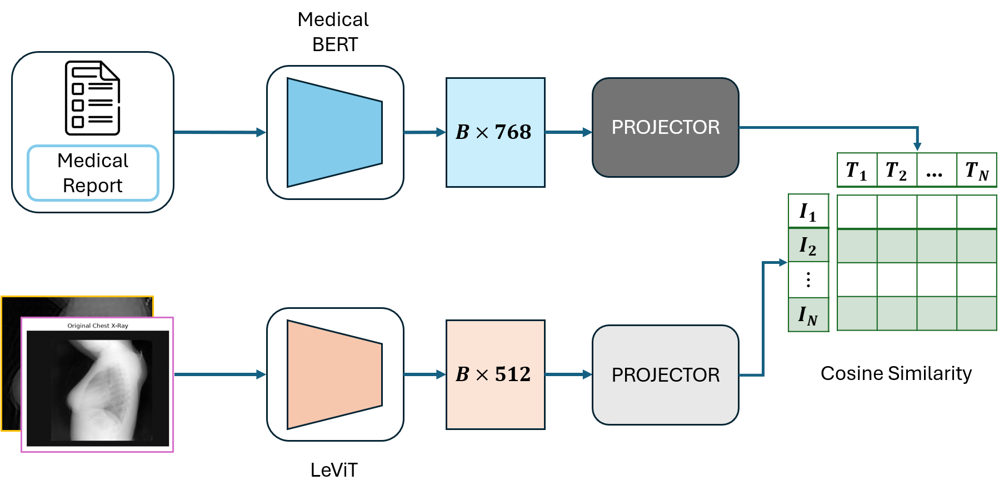
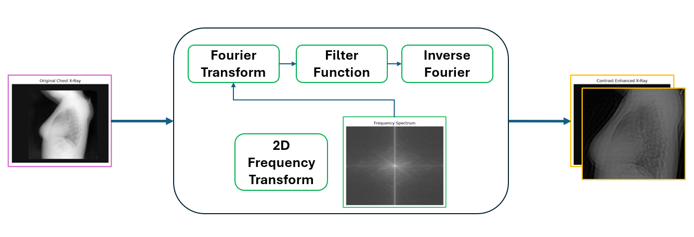

# Frequency-Domain Enhanced Vision-Language Model for Radiology

A lightweight medical Vision-Language Model (VLM) that integrates **frequency-domain image enhancement**, **LeViT** for visual representation learning, and **ClinicalBERT** for medical language understanding. The framework learns a shared embedding space between chest X-ray images and their corresponding radiology reports using contrastive learning.

---

## Overview

Radiological images often suffer from low contrast, acquisition variability, and subtle pathological patterns that challenge conventional vision-language models. This project enhances chest X-ray images in the **frequency domain** prior to visual encoding, enabling improved image representation and image-text alignment.

The framework is trained on paired chest X-ray images and radiology reports from the **IU X-Ray** dataset.

---

## Framework

  

**Figure 1.** Proposed Frequency-Domain Enhanced Vision-Language Learning framework. Chest X-ray images are first enhanced in the frequency domain and then encoded using LeViT, while paired radiology reports are encoded using ClinicalBERT. Both modalities are projected into a shared embedding space and optimized using contrastive learning.

The proposed framework consists of:

- **Frequency-Domain Image Enhancement**
- **LeViT Image Encoder**
- **ClinicalBERT Text Encoder**
- **Modality-Specific Projection Heads**
- **Contrastive Image-Text Representation Learning**

---

## Frequency-Domain Image Enhancement

  

**Figure 2.** Proposed frequency-domain image enhancement framework. The pipeline applies Fast Fourier Transform (FFT), frequency-domain filtering, high-frequency enhancement, inverse FFT reconstruction, and intensity normalization to improve image quality while preserving diagnostically relevant anatomical structures.

Before feature extraction, each radiological image is enhanced in the frequency domain through:

- Fast Fourier Transform (FFT)
- Frequency filtering
- High-frequency detail enhancement
- Inverse FFT reconstruction
- Contrast normalization

This preprocessing improves visual quality while preserving anatomical structures, enabling the image encoder to learn more discriminative representations.

---

## Model Components

- **Image Encoder:** LeViT
- **Text Encoder:** ClinicalBERT
- **Projection Heads:** Linear embedding projection
- **Training Objective:** Contrastive Image-Text Learning
- **Dataset:** IU X-Ray

---

## Citation

## License

This project is released under the MIT License.
